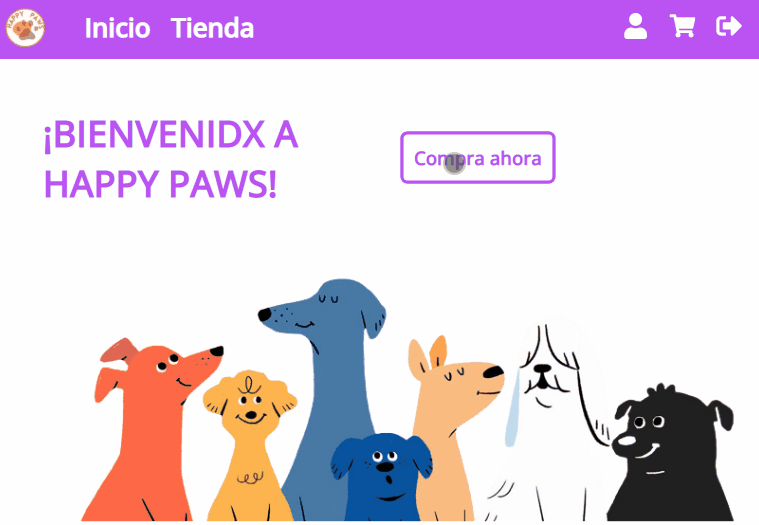
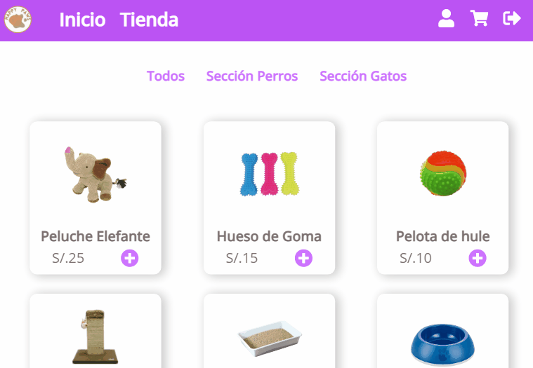
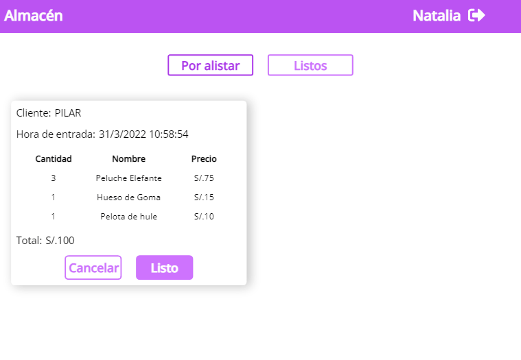
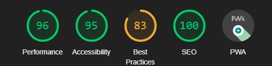

 
  
<!-- 
 <h1 align="center"> Tienda online de accesorios para mascotas</h1> -->

## Índice

[1. Happy Paws](#1-happy-paws)

[2. Estudio de usuario](#2-estudio-de-usuario)

[3. Diseño de la interfaz de usuario](#3-diseño-de-la-interfaz-de-usuario)

[4. Tecnologías empleadas](#4-tecnologías-empleadas)

[5. Producto final](#5-producto-final)

[6. Desarrolladoras](#6-desarrolladoras)
  

## **1.HAPPY PAWS**

### **1.1 Descripción del proyecto**

Happy Paws es una tienda online de accesorios para gatos y perros en la que se puede realizar una compra, procesarla en el área del almacén, marcarla como lista y dirigirla al área del delivery para su posterior envío al cliente.
Está enfocada en el cliente y también en el administrador, de modo que agilice toda la logística al realizarse una compra.  

### **1.2 Roles de la plataforma**

- Cliente
- Administrador
- Almacén
- Delivery
    

## **2. Estudio de usuario**

**a) ¿Quiénes son los principales usuarios?**  
Cliente, administrador, área de almacén y área de delivery.

**b) ¿Cuáles son los objetivos de estos usuarios en relación con el producto?**  
| Usuarios | Objetivo |
| --- | --- |
| Cliente | Usuario que solo tendrá permitido acceder a la sección de la tienda donde podrá seleccionar los productos deseados y realizar la compra. |
| Administrador | Este usuario tiene acceso a la sección de "añadir productos" y "agregar empleados", además de poder visualizar las otras vistas de la plataforma. |
| Almacén | El área del almacén podrá visualizar los pedidos entrantes para posteriormente marcarlos como "encontrados" o cancelarlos si no tuvieran suficiente stock del producto solicitado|
| Delivery | El área del delivery es la última instancia por donde la compra pasará después de ser marcada como "encontrada" por el área del almacén. Finalmente, serán los encargados de realizar el envío de dicho producto al cliente.   

## **3. Diseño de la interfaz de usuario**

### **3.1 Prototipo de baja fidelidad**

El diseño inicial de la plataforma fue trabajado en Canva.
Puede verlo con más detalle [aquí.](https://www.canva.com/design/DAE4n3Db3as/Rp340bLg1KrCSVtkBxJsSQ/view?utm_content=DAE4n3Db3as&utm_campaign=designshare&utm_medium=link2&utm_source=sharebutton)

### **3.2 Prototipo de alta fidelidad**

Después de ya realizar el primer prototipo en Canva, procedimos a realizar el prototipo final en Figma. Puede visualizar el prototipo en este [link.](https://www.figma.com/file/7Wfa1lsA28zxarLywHvePF/Happy-paws?node-id=0%3A1)
  

## **4. Tecnologías empleadas**

- React
- Firebase
- JavaScript
- Testing Library
- HTML
- CSS
- Eslint
- Figma
- PWA
    

## **5. Producto final**

### **Vista bienvenida, registro e inicio de sesión:**  

 

### **Vista Cliente:**  

 

### **Vista Administrador:**  

 

### **Vista almacén y delivery:**  

  

### **Puntuación PWA**

  

## 6. Desarrolladoras 👩‍💻

- [Natalia Bravo](https://github.com/Natalia7919)
- [Dolly Ochoa](https://github.com/DollyPilar)
